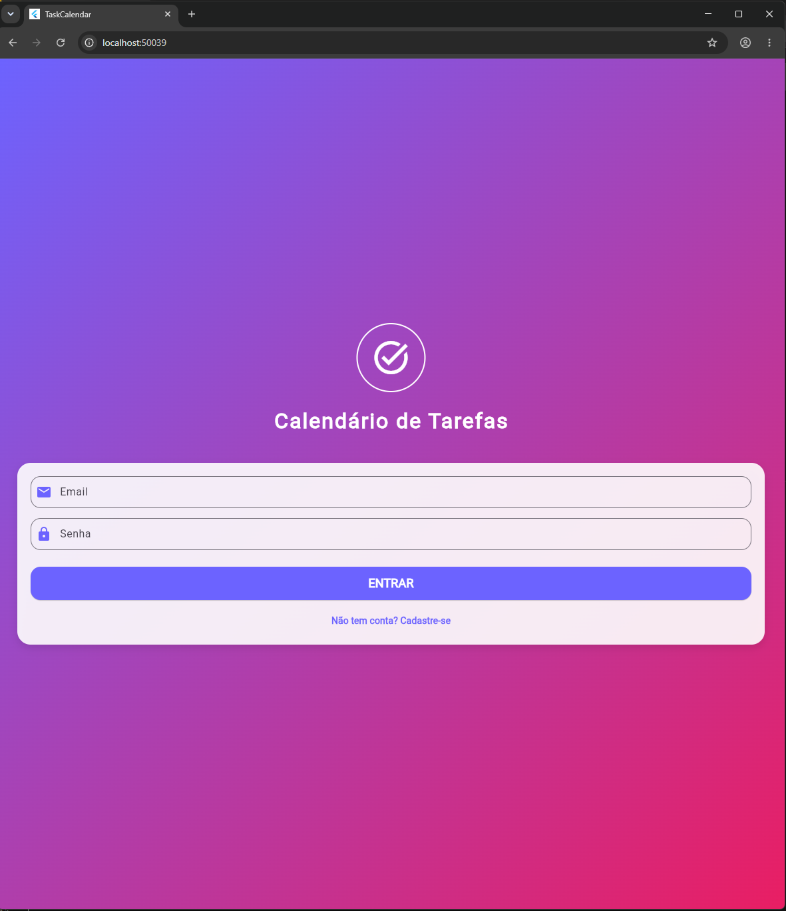
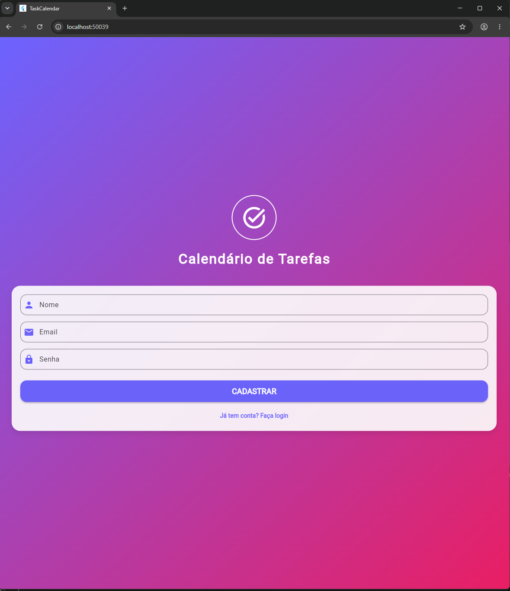
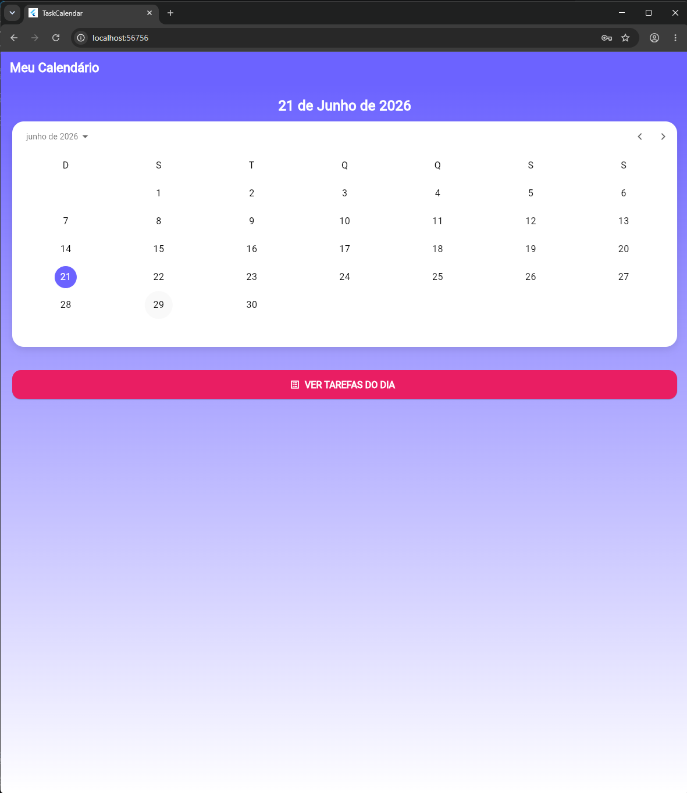
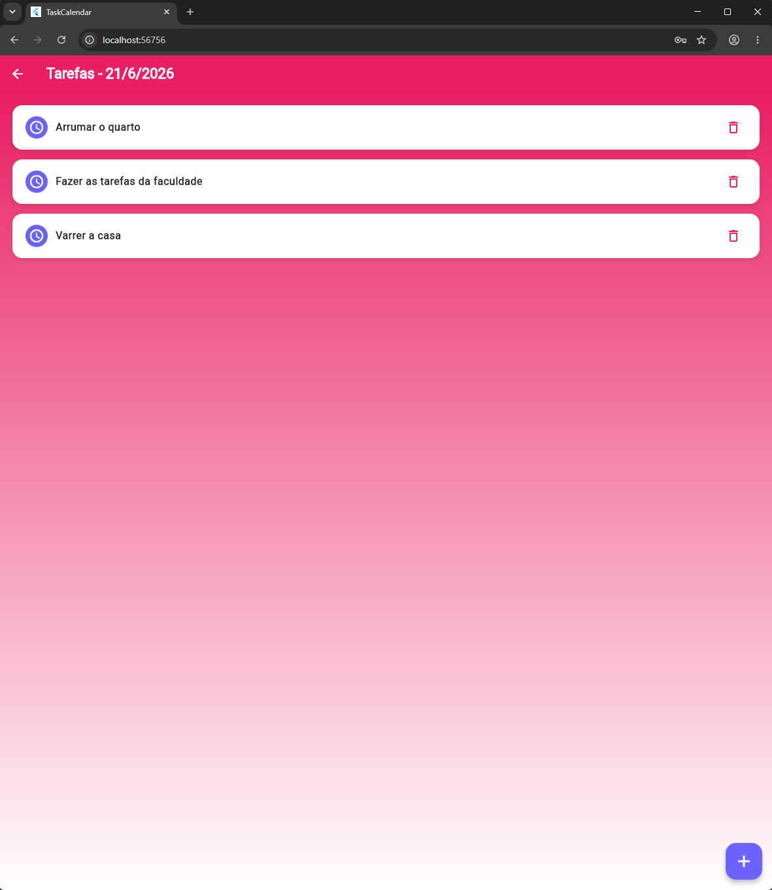
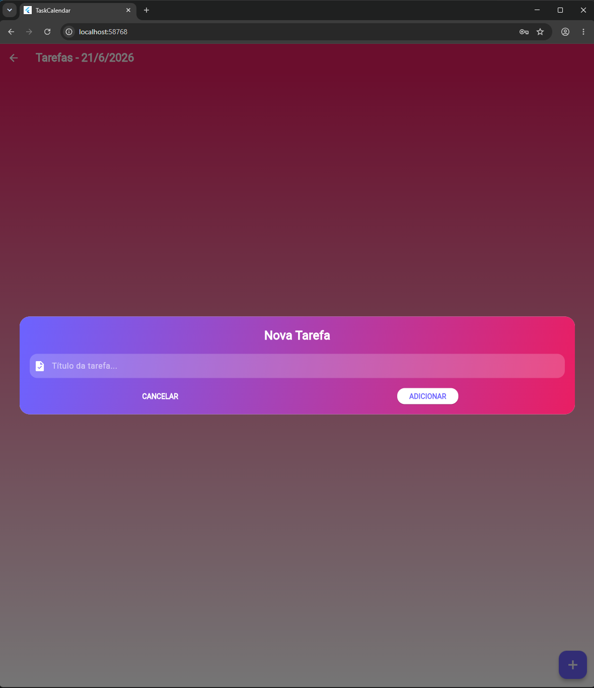

# Lista de Tarefas App

Aplicativo Flutter para gerenciamento de tarefas diárias com calendário integrado.

## Funcionalidades

- Tela de login e cadastro de usuário
- Calendário para selecionar datas
- Adicionar tarefas no dia selecionado
- Marcar tarefas como concluídas
- Remover tarefas da lista
- Lista ordenada: pendentes primeiro, depois concluídas (ordem alfabética)

## Como Usar

### Login/Cadastro
1. Abra o aplicativo
2. Preencha email e senha
3. Clique em "ENTRAR" para acessar
4. Se não tiver conta, clique em "Não tem conta? Cadastre-se"
5. Preencha nome, email e senha
6. Clique em "CADASTRAR"

### Calendário
1. Após o login, você verá o calendário
2. Escolha um dia clicando na data desejada
3. Clique no botão "VER TAREFAS DO DIA"

### Tarefas
1. Na tela de tarefas, clique no botão "+" para adicionar
2. Digite o título da tarefa na janela que abrir
3. Clique em "ADICIONAR"
4. Para concluir, clique no círculo roxo da tarefa
5. Para remover, clique no ícone de lixeira

## Como Executar

1. Instale o Flutter SDK
2. Clone o repositório
3. Execute o comando:

flutter run

## Telas

### Tela de Login

### Tela de Cadastro

### Tela do Calendário

### Tela de Tarefas

### Tela de Adição de Tarefas

## Tecnologias

Flutter
Dart